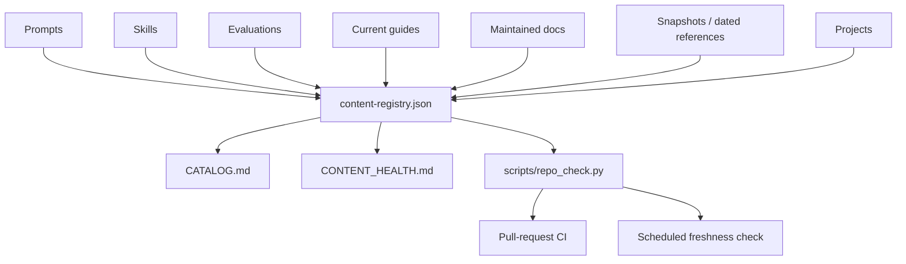

# Repository Architecture

`llm-queries` is a knowledge repository with a small runnable-project area.
Its architecture should optimize for **discoverability, freshness, and
testability**, not for application packaging.

## Content layers

## Responsibilities

### `prompts/`

Reusable instructions for accomplishing a task. Prompts should be
model-agnostic unless a dependency is essential.

### `skills/`

Reusable procedures for LLM work such as evaluation, context engineering,
retrieval auditing, and tool design.

### `evaluations/`

Task suites with observable outcomes. This is where benchmarks, MCP tests, and
tool-use checks belong.

### `local_setup_guides/`

A deliberately small set of commands intended to work now. These are
version-sensitive and must have verification dates.

### `docs/`

Maintained repository documentation and durable reference material, including
the architecture, lifecycle policy, and glossary. These files are registered
and validated like other managed content.

### `resources/`, `course_reviews/`, `news/`, `snapshots/`

Source-specific or dated material. These preserve context but are not treated as
current operational guidance.

### `projects/`

Self-contained runnable experiments. Dependencies and status stay local to each
project.

## Registry as source of truth

[`content-registry.json`](../content-registry.json) records lifecycle metadata
for every non-index content document:

- kind
- freshness class
- status
- review interval
- last verification date when applicable

The registry is intentionally separate from Markdown so old documents do not
need large metadata-only edits.

## Generated surfaces

Two files are generated from the tree and registry:

- `CATALOG.md` — discoverability
- `CONTENT_HEALTH.md` — maintenance state

Do not hand-edit either file.

## Validation boundary

`scripts/repo_check.py` uses only the Python standard library. It verifies:

- local Markdown links
- registry coverage and valid metadata
- visible lifecycle banners for non-active content
- source provenance for historical material
- minimum prompt structure
- generated catalog/health files
- freshness of active version-sensitive content when strict mode is enabled

Normal PR CI checks structure. A scheduled job runs strict freshness checks so
time itself can make CI fail when a supposedly current guide becomes overdue.

## Design principle

A file can be **useful but historical**. The architecture makes that state
explicit instead of forcing maintainers to either delete old material or leave
it looking current.

## Executable evaluations

Machine-readable cases live under `evaluations/specs/`. The provider-neutral
runner in `scripts/run_evals.py` can score captured outputs or invoke a local
stdin/stdout command. Reports record the spec hash and repository commit, and
`scripts/compare_eval_reports.py` detects case-level regressions.

This deliberately separates the benchmark definition from a particular model
vendor or serving stack.

## Network maintenance

Internal links are checked on every pull request. External source links are
audited by `scripts/check_external_links.py` on the scheduled maintenance run.
Only hard missing responses such as HTTP 404/410 fail that check; authentication
blocks, rate limits, and transient network/server failures are warnings.
