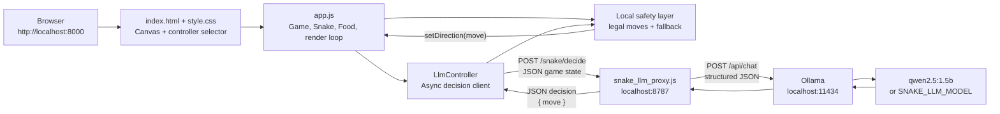
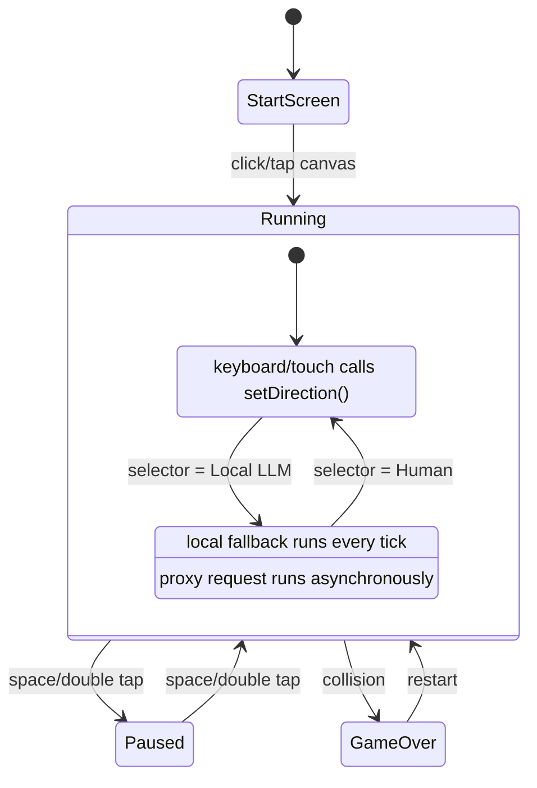
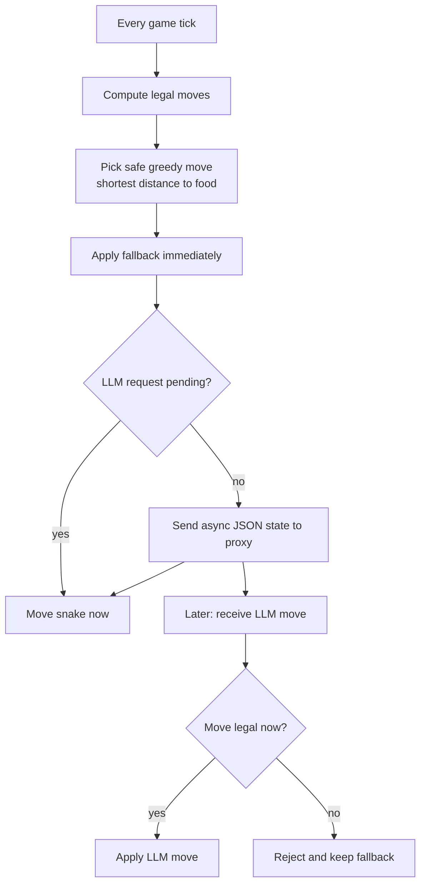
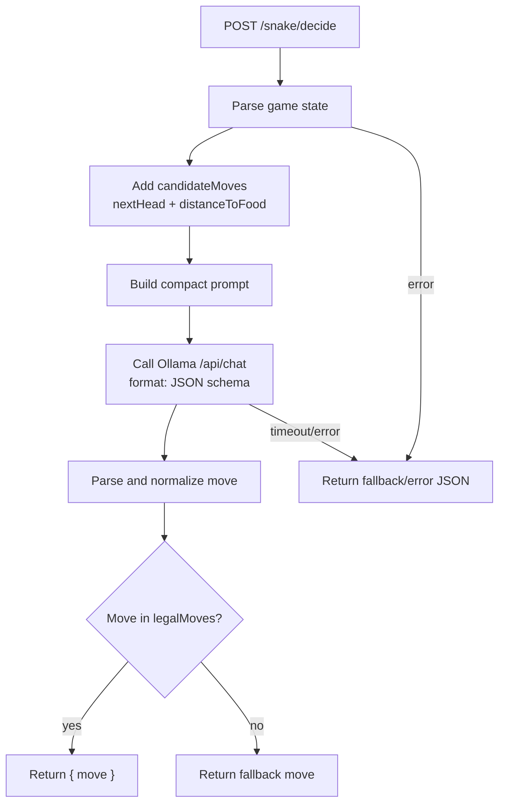

# Snake LLM Controller Architecture

This Snake tool keeps the existing canvas game UI and adds an optional local LLM controller behind the scenes. Human play still works without Ollama or the proxy server.

## Runtime Components



## Control Modes



## Game Tick Flow

The game loop remains owned by `app.js`. The LLM never moves the snake directly; it only suggests a direction.

```mermaid
sequenceDiagram
    participant Loop as Game.gameLoop()
    participant LLM as LlmController
    participant Safe as Local safety layer
    participant Snake as Snake
    participant Proxy as LLM proxy
    participant Ollama as Ollama model

    Loop->>LLM: update(game)
    LLM->>Safe: getSafeMove(game)
    Safe-->>LLM: safe fallback move
    LLM->>Snake: setDirection(fallback)

    alt no request pending
        LLM->>Proxy: POST compact game state
        Proxy->>Ollama: ask for {"move":"..."}
        Ollama-->>Proxy: JSON response
        Proxy-->>LLM: { "move": "right" }
        LLM->>Safe: validate move
        Safe-->>LLM: accepted/rejected
        opt accepted
            LLM->>Snake: setDirection(llmMove)
        end
    else request already pending
        LLM-->>Loop: skip network, keep fallback
    end

    Loop->>Snake: move()
    Loop->>Loop: collision/eat/render
```

## Why There Is A Local Fallback

The browser cannot wait for the model before every movement tick. Snake starts at a 200 ms tick and gets faster with levels, while even small local models can take hundreds of milliseconds or seconds.

The fallback is therefore part of the control system:



This prevents border crashes caused by slow model responses. The LLM can improve or override direction when it responds in time, but the game always has a local safe move ready.

## JSON Contract

Browser to proxy:

```json
{
  "gridSize": 20,
  "head": { "x": 10, "y": 10 },
  "snake": [{ "x": 10, "y": 10 }],
  "direction": "right",
  "food": { "x": 14, "y": 10 },
  "obstacles": [],
  "score": 0,
  "level": 1,
  "legalMoves": ["up", "down", "right"]
}
```

Proxy to browser:

```json
{
  "move": "right"
}
```

Allowed moves are `up`, `down`, `left`, and `right`. The browser validates every returned move against the current board before applying it.

## Proxy Responsibilities



The proxy uses:

- `SNAKE_LLM_PORT`, default `8787`
- `OLLAMA_URL`, default `http://localhost:11434/api/chat`
- `SNAKE_LLM_MODEL`, default `qwen2.5:1.5b`
- `SNAKE_LLM_TIMEOUT_MS`, default `8000`

## Local Setup

Install the default model:

```bash
ollama pull qwen2.5:1.5b
```

Start the proxy from this directory:

```bash
node snake_llm_proxy.js
```

Serve the static site:

```bash
cd projects/snake-llm
python3 -m http.server 8000
```

Open:

```text
http://localhost:8000
```

Start the game and switch `Controller` to `Local LLM`.

## File Map

```text
index.html          Canvas and controller selector
style.css           Snake page styling
app.js              Game loop, input handling, LLM controller, validation
snake_llm_proxy.js  Local HTTP proxy from browser to Ollama
```

## Design Notes

- The game remains static-site friendly. If the proxy is not running, human mode still works.
- The LLM is advisory. It never bypasses local collision and legal-move validation.
- The fallback runs every tick, including while the previous LLM request is still pending.
- The proxy adds `candidateMoves` so lightweight models do less coordinate reasoning.
- `qwen2.5:1.5b` is the current default because it returned useful JSON decisions in testing.
